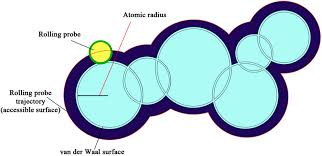

# Solvent Accessible Surface Area for Proteins

## Summary

This report provides a comprehensive overview of Solvent Accessible Surface Area (SASA) for proteins. SASA is a critical parameter in protein science, influencing various physico-chemical and thermodynamic properties. The report covers the definition, significance, and calculation methods of SASA, along with its applications in protein structure prediction, protein-protein interactions, and drug design.

The report begins by introducing the concept of SASA, defined as the extent to which atoms on the surface of a protein can form contacts with solvent molecules. It explains the pioneering work of Lee and Richards in 1971, who introduced the concept of SASA and provided algorithms for its calculation. Various methods for calculating SASA in both folded and unfolded states are discussed, including Z-layer Integration Method, Intersection Method, Shrake and Rupley Algorithm, Linear Combinations of Pairwise Overlaps (LCPO) Method, Power Diagram Method, and others.

Furthermore, the report highlights the role of SASA in protein structure prediction, protein-protein interactions, and drug design. It discusses how SASA is used to understand protein folding, stability, and function, as well as its importance in studying protein-DNA and protein-ligand interactions. Various computational tools and online resources for calculating SASA are listed, including PDBePISA, CCP4*, ProtSA, GETAREA, DSSP, and others.

Additionally, the report provides insights into recent research findings and applications of SASA, such as its use in analyzing protein-protein networks, predicting binding specificity, and studying protein mobility. It emphasizes the significance of SASA in understanding the structure-function relationship of proteins and its implications for drug discovery and protein engineering.

## Images

  

Fig. 1: A cross-section of a part of a macromolecule in space rolling probe, van der Waals and accessible surface areas are indicated.

  

Fig. 2: Three-dimensional representation of SASA of a protein on which water molecule is rolling (Green). The relative size of water molecule can be compared with nitrogen (blue) and oxygen (red).

## References

